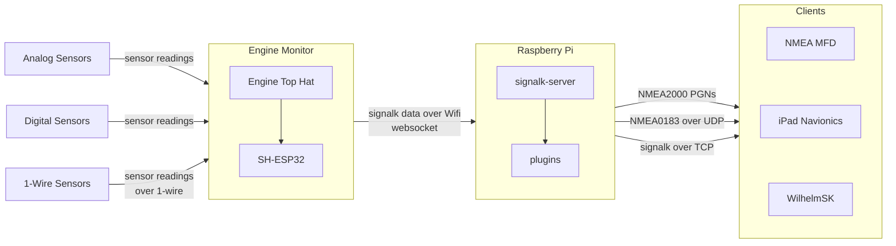
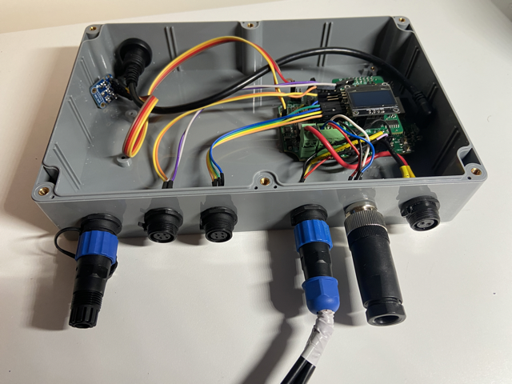

# Engine Monitor based on SH-ESP32 with Engine Hat, SensESP and SignalK

This repository provides code for the [SH-ESP32](https://docs.hatlabs.fi/sh-esp32/) with the [Engine Top Hat](https://docs.hatlabs.fi/sh-esp32/pages/add-ons/engine-hat/) (discontinued product, successor is [HALMET](https://shop.hatlabs.fi/products/halmet)) to monitor engine, fuel tank and environmental data.
It is based on the [SensESP](https://github.com/SignalK/SensESP/) 3.x library.

With this code running on a SH-ESP with Engine Top hat, the device sends [signalk](https://signalk.org/) formatted data to a [signalk-server](https://github.com/SignalK/signalk-server), which can make it available through [signalk-to-nmea2000](https://github.com/SignalK/signalk-to-nmea2000) plugin on the NMEA2000 / STNG bus.

I have the solution connected to a Volvo Penta MD2020 engine, this is what it looks like:

## Mapping of sensors on SH-ESP32 and Engine Hat

Table below shows the connected sensors.

| Connector       | Sensor                                                                                  | Pin       | Jumper   | Signalk path                                 | NMEA2000 PGN  |
| --------------- | --------------------------------------------------------------------------------------- | --------- | -------- | -------------------------------------------- | ------------- |
| 6. Power        | 12V Power +                                                                             | 12V+      | N/A      | N/A                                          |               |
| 6. Power        | Ground                                                                                  | GND       | N/A      | N/A                                          |               |
| 5. CAN          | Connect [four wires](http://docs.hatlabs.fi/sh-esp32/pages/tutorials/nmea2000-gateway/) | CAN-block | N/A      | N/A                                          |               |
| 4. 1-wire #1    | Temp oil carter                                                                         | 1-wire #1 | N/A      | propulsion.1.oilTemperature                  | 127489        |
| 4. 1-wire #1    | Temp engine room                                                                        | 1-wire #1 | N/A      | environment.inside.engineRoom.temperature    |               |
| 4. 1-wire #1    | Temp cabin                                                                              | 1-wire #1 | N/A      | environment.outside.temperature              | 130310        |
| 3. EngineHat1   | Cooling water engine sender                                                             | A1        | yes      | propulsion.1.temperature                     | 127489        |
| 3. EngineHat1   | Cooling water engine alarm                                                              | D1        | no       | notifications.propulsion.1.overTemperature   |               |
| 3. EngineHat1   | Oil pressure engine sender                                                              | A2        | yes      | propulsion.1.oilPressure                     | 127489        |
| 3. EngineHat1   | Oil pressure engine alarm                                                               | D3        | yes      | notifications.propulsion.1.lowOilPressure    |               |
| 2. EngineHat2   | Fuel tank sender                                                                        | A3        | nee      | tanks.fuel.1.currentLevel en currentVolume   |               |
| 2. EngineHat2   | RPM (W-terminal alternator)                                                             | D2        | no       | propulsion.1.revolutions                     | 127489,127488 |
| 2. EngineHat2   | NOT USED                                                                                | A4        | -        |                                              |               |
| 2. EngineHat2   | NOT USED                                                                                | D4        | -        |                                              |               |
| 1. 1-Wire #2    | Future: fridge                                                                          | 1-wire #2 | N/A      | environment.inside.refridgerator.temperature | 130312        |
| 1. 1-wire #2    | Future: starter battery                                                                 | 1-wire #2 | N/A      |                                              | 127508        |
| Internal BME280 | Temperature                                                                             | I2C       | N/A      | environment.inside.enginehat.temperature     |               |
| Internal BME280 | Atmospheric Pressure                                                                    | I2C       | N/A      | environment.outside.pressure                 | 130314        |
| Internal BME280 | Relative Humidity                                                                       | I2C       | N/A      | environment.outside.relativeHumidity         | 130313        |
| Top - micro USB |                                                                                         | USB       | USB-port |                                              |               |

Explanation of this table:

- Connector: the connectors on the front from right to left
- Sensor: the connected sensor
- PIN: the pin (of other interface) where the sensor is connected to the SH-ESP32 or Engine Hat add-on board
- Jumper: if the jumper on the Engine Hat is enabled or not
- Signalk-path: the path where the sensor will be reporting into
- NMEA2000 PGN: the NMEA2000 PGN that is supported on Raymarine devices (should be mapped by signak-to-nmea2000 plugin)

# Links

Useful resources:

- [Getting Started](https://signalk.org/SensESP/pages/getting_started/) with SensESP.
- [SensESP examples code](https://github.com/SignalK/SensESP/tree/main/examples) for implementing sensors (coolant temperature sender, 1-wire sensors, RPM counters, etc).
- [SenseSP 3.x Starter Template](https://github.com/SensESP/SensESP-project-template), used as base for this project.
- Example code for the [Engine Top Hat](https://github.com/hatlabs/SH-ESP32-engine-hat-firmware).
- Previous [bhavers/SH-ESP32-engine-hat-firmware](https://github.com/bhavers/SH-ESP32-engine-hat-firmware) repository based on SensESP 2.x which is not maintained anymore. The repo is archived.

# Credits

Credits and thanks to [Hat Labs](https://github.com/hatlabs) and [SignalK](https://signalk.org/) community for providing such high quality hardware, software and support.
